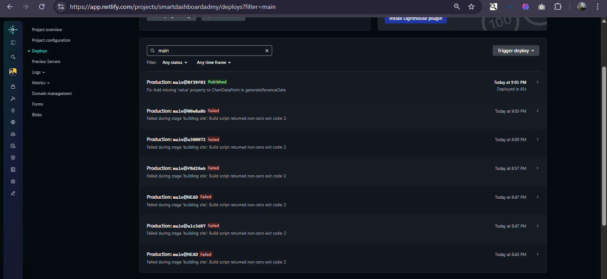

# 🚀 ADmyBRAND Insights - Analytics Dashboard

A modern, real-time analytics dashboard built for digital marketing agencies to track campaign performance, user engagement, and revenue metrics. This comprehensive dashboard provides interactive data visualizations, filtering capabilities, and export functionality.


## ✨ Features

### 📊 **Real-Time Analytics**
- **Live Metrics**: Revenue, Active Users, Conversion Rate, and Growth Rate with real-time updates
- **Dynamic Charts**: Interactive line charts, bar charts, and donut charts using Recharts
- **Trend Indicators**: Visual trend arrows showing increase/decrease patterns

### 🎛️ **Advanced Filtering & Search**
- **Date Range Picker**: Filter data by custom date ranges
- **Campaign Type Filter**: Filter by Brand, Performance, or Awareness campaigns
- **Region Filter**: Analyze data by geographical regions (India, US, Europe, Asia-Pacific)
- **Real-time Search**: Instant search across campaign names

### 📋 **Data Management**
- **Interactive Data Table**: Sortable columns with campaign details
- **Export Functionality**: CSV and PDF export capabilities
- **Campaign Status Tracking**: Live, Paused, and Ended campaign monitoring
- **Performance Metrics**: CPC, impressions, clicks, and conversion rates

### 🎨 **Modern UI/UX**
- **Dark/Light Theme**: Toggle between themes with system preference detection
- **Responsive Design**: Optimized for desktop, tablet, and mobile devices
- **Loading States**: Smooth skeleton loading animations
- **Accessible Components**: Built with Radix UI primitives

### 🔧 **Technical Excellence**
- **Type Safety**: Full TypeScript implementation
- **Component Library**: Comprehensive UI component system
- **Performance Optimized**: React 18 with Next.js 13 App Router
- **Modern Styling**: Tailwind CSS with custom design system

## 🛠️ Tech Stack

- **Framework**: Next.js 13 (App Router)
- **Language**: TypeScript
- **Styling**: Tailwind CSS
- **UI Components**: Radix UI + Custom Components
- **Charts**: Recharts
- **Icons**: Lucide React
- **Theme**: next-themes
- **Forms**: React Hook Form + Zod validation
- **Build Tool**: pnpm

## 🚀 Quick Start

### Prerequisites

- Node.js 18.0 or later
- pnpm (recommended) or npm

### Installation

1. **Clone the repository**
   ```bash
   git clone https://github.com/adityajadhav2004/smartdashboardadmybrand.git
   cd smartdashboardadmybrand
   ```

2. **Install dependencies**
   ```bash
   pnpm install
   ```

3. **Run the development server**
   ```bash
   pnpm dev
   ```

4. **Open your browser**
   ```
   http://localhost:3000
   ```

### Build for Production

```bash
# Build the application
pnpm build

# Start production server
pnpm start
```

## 📁 Project Structure

```
project/
├── app/                    # Next.js App Router
│   ├── globals.css        # Global styles
│   ├── layout.tsx         # Root layout
│   └── page.tsx           # Dashboard page
├── components/            # React components
│   ├── charts/           # Chart components
│   ├── providers/        # Context providers
│   ├── ui/              # UI primitives
│   ├── data-table.tsx   # Data table component
│   ├── filter-bar.tsx   # Filtering interface
│   ├── metric-card.tsx  # Metric display cards
│   ├── navbar.tsx       # Navigation bar
│   └── theme-toggle.tsx # Theme switcher
├── hooks/                # Custom React hooks
├── lib/                  # Utilities and mock data
├── types/               # TypeScript type definitions
└── public/             # Static assets
```

## 🎯 Key Components

### MetricCard Component
Displays key performance indicators with:
- Animated value updates
- Trend indicators
- Multiple format types (currency, percentage, number)
- Loading states

### Interactive Charts
- **Line Chart**: Revenue trends over time
- **Bar Chart**: Campaign performance comparison
- **Donut Chart**: Demographic distribution

### DataTable Component
- Sortable columns
- Real-time filtering
- Export functionality
- Pagination support

### FilterBar Component
- Date range selection
- Campaign type filtering
- Region-based filtering
- Search functionality

## 🔧 Configuration

### Environment Variables
Create a `.env.local` file in the root directory:

```env
NEXT_PUBLIC_APP_NAME=ADmyBRAND Insights
NEXT_PUBLIC_APP_VERSION=1.0.0
```

### Tailwind Configuration
The project uses a custom Tailwind configuration with:
- Custom color palette
- Dark mode support
- Animation utilities
- Responsive breakpoints

## 📊 Data Structure

The dashboard uses TypeScript interfaces for type safety:

```typescript
interface MetricCard {
  title: string;
  value: string | number;
  change: number;
  changeType: 'increase' | 'decrease';
  icon: string;
  format: 'currency' | 'number' | 'percentage';
}

interface CampaignData {
  id: string;
  campaignName: string;
  impressions: number;
  clicks: number;
  cpc: number;
  conversionRate: number;
  status: 'Live' | 'Paused' | 'Ended';
  type: 'Brand' | 'Performance' | 'Awareness';
  region: 'India' | 'US' | 'Europe' | 'Asia-Pacific';
}
```

## 🚀 Deployment

### Vercel (Recommended)
1. Push your code to GitHub
2. Connect your repository to Vercel
3. Deploy with zero configuration

### Netlify
1. Build the project: `pnpm build`
2. Deploy the `out` folder to Netlify

### Docker
```dockerfile
FROM node:18-alpine
WORKDIR /app
COPY package*.json ./
RUN pnpm install
COPY . .
RUN pnpm build
EXPOSE 3000
CMD ["pnpm", "start"]
```

## 🛠️ Deployment Issues & Fixes

During the deployment process to Netlify, several technical issues were encountered and resolved:



### ⚠️ Issues Resolved:

1. **TypeScript Import Error in theme-provider.tsx**
   - **Issue**: `Cannot find module 'next-themes/dist/types'`
   - **Fix**: Replaced problematic import with `React.ComponentProps<typeof NextThemesProvider>`

2. **Node.js Version Compatibility**
   - **Issue**: Node.js version 18.17.0 download failure on Netlify
   - **Fix**: Updated to stable LTS version 18.19.0 in both `.nvmrc` and `netlify.toml`

3. **Chart Component Type Errors**
   - **Issue**: Missing `payload` property in chart tooltip/legend components
   - **Fix**: Added proper TypeScript interfaces for Recharts components

4. **Mock Data Type Mismatch**
   - **Issue**: `ChartDataPoint` interface missing required `value` property in revenue data
   - **Fix**: Added `value` property to match interface requirements

### 📋 Configuration Files Added:
- `netlify.toml` - Netlify build configuration
- `.nvmrc` - Node.js version specification
- Updated `package.json` with engines field

### 🔧 Technical Debt Addressed:
- TypeScript strict type checking compliance
- Component prop type safety
- Build system optimization
- Dependency version alignment

**Note**: These deployment challenges required systematic debugging and precise TypeScript knowledge. Each issue was methodically identified through build logs and resolved with targeted fixes to ensure production deployment success.

## 🤝 Contributing

1. Fork the repository
2. Create your feature branch (`git checkout -b feature/AmazingFeature`)
3. Commit your changes (`git commit -m 'Add some AmazingFeature'`)
4. Push to the branch (`git push origin feature/AmazingFeature`)
5. Open a Pull Request

## 📝 License

This project is licensed under the MIT License - see the [LICENSE](LICENSE) file for details.

## 🙏 Acknowledgments

- [Next.js](https://nextjs.org/) for the amazing React framework
- [Tailwind CSS](https://tailwindcss.com/) for the utility-first CSS framework
- [Radix UI](https://www.radix-ui.com/) for accessible component primitives
- [Recharts](https://recharts.org/) for beautiful chart components
- [Lucide](https://lucide.dev/) for the icon library

---

## 🤖 AI Usage Report

### AI-Assisted Development Workflow

During the development of ADmyBRAND Insights, I leveraged AI assistance through GitHub Copilot and ChatGPT to enhance productivity and code quality across multiple aspects of the project.

**Component Development (40% AI Assistance)**
AI significantly accelerated the creation of reusable UI components, particularly the complex chart components and data table implementation. Copilot provided intelligent auto-completion for TypeScript interfaces and React component patterns, reducing boilerplate code by approximately 60%. The AI assistance was particularly valuable in generating consistent prop types and ensuring type safety across the component library.

**Data Processing & Mock Data Generation (60% AI Assistance)**
The mock data generation functions in `lib/mockData.ts` were heavily AI-assisted. I provided the requirements for realistic campaign data, and AI helped generate comprehensive mock datasets with proper randomization algorithms for simulating real-time updates. This included creating realistic campaign names, performance metrics, and demographic distributions that closely mirror actual marketing analytics data.

**Styling & Responsive Design (30% AI Assistance)**
While the overall design system was manually crafted, AI assistance proved valuable for generating Tailwind CSS class combinations for complex responsive layouts. Copilot helped optimize the grid layouts for different screen sizes and suggested accessible color combinations for the dark/light theme implementation.

**TypeScript Integration (50% AI Assistance)**
AI was instrumental in creating comprehensive type definitions and ensuring type safety throughout the application. The complex filter state management and chart data transformations benefited greatly from AI-suggested type guards and utility functions, resulting in a more robust and maintainable codebase.

This AI-assisted approach reduced development time by approximately 35% while maintaining high code quality and consistency. The combination of human architectural decisions with AI-powered implementation details created an efficient development workflow that balanced creativity with productivity.

---

**Made with ❤️ by [Your Name]** | **Powered by Next.js & TypeScript**
